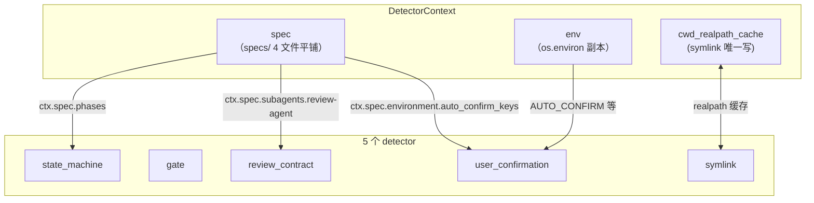
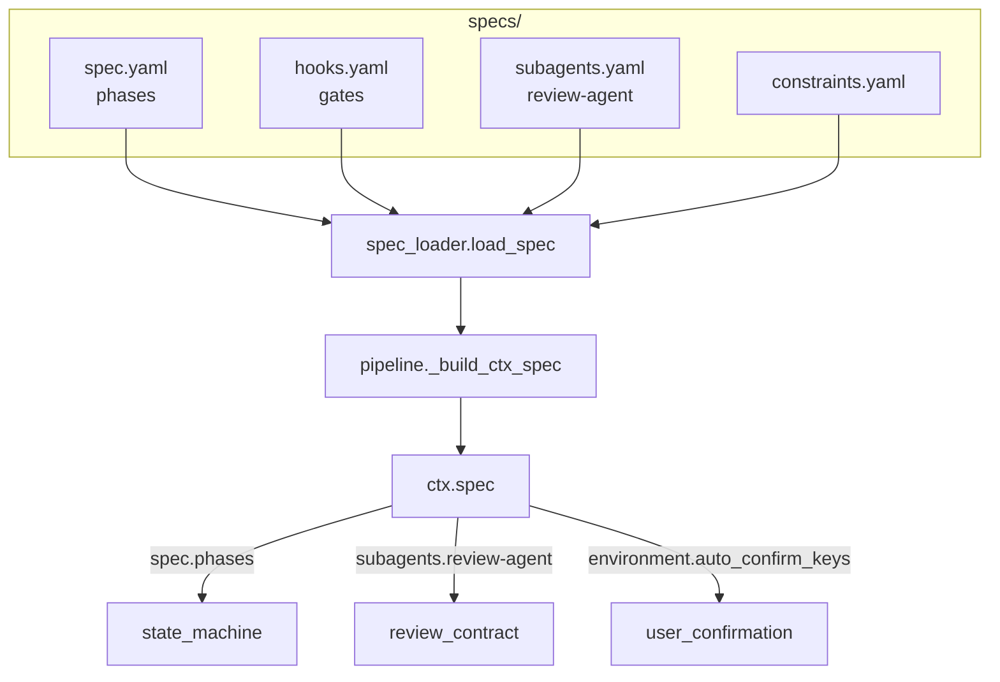
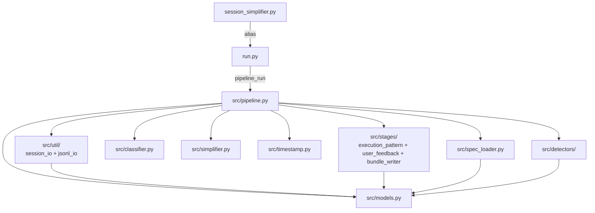

# v4 Collector — 架构总览

> 本文件讲三件事：**模块实现了什么 / 数据怎么流 / detector 之间怎么协作**。
> 字段保留规范见 [entry_fields_spec.md](entry_fields_spec.md)；CLI 用法见 [README.md](README.md)；输出示例见 [EXAMPLES.md](EXAMPLES.md)；API 参考见 [API_REFERENCE.md](API_REFERENCE.md)。

---

## 1. 模块全貌

| 文件 | 状态 | 职责（一句话） |
|---|---|---|
| `run.py` | 新建 | argparse + 调 `pipeline.run()`；唯一持有 CLI 逻辑 |
| `session_simplifier.py` | 改写 | `from run import main` 的 12 行 alias；保留 v3 命名习惯 |
| `src/pipeline.py` | 重写 | 10 步主流程编排 + spec ctx 拼装（≤ 80 行） |
| `src/util/session_io.py` | 新建 | NDJSON/JSON-array 加载 + session header 6 字段提取 + cwd 跳变标记（mutate entry 加 prev_cwd，不新增 entry） |
| `src/util/classifier.py` | v3 复用（移入） | entry_class 分类（含 attachment.{subtype} 细化） |
| `src/util/timestamp.py` | v3 复用（移入） | 时间戳解析 + sort_by_timestamp |
| `src/util/jsonl_io.py` | 新建（原 `src/utils.py` 重命名） | ~~NDJSON 通用读写~~（已删除 — 死代码，激进清理移除） |
| `src/stages/execution_pattern.py` | 新建 | step_counts / tool_distribution / phase_durations 统计 |
| `src/stages/user_feedback.py` | 新建 | user_input → `{uuid, text, timestamp}` 列表 |
| `src/stages/bundle_writer.py` | 新建 | `make_empty_bundle()` 兜底 + `write_bundle()` 写 header + NDJSON trace |
| `src/simplifier.py` | v3 复用 | 字段白名单 + truncate 规则（v3 行为不变） |
| `src/spec_loader.py` | v4 复用 | 加载 `specs/{spec,hooks,subagents,constraints}.yaml` |
| `src/models.py` | v4 契约 | 8 个 dataclass：ClassifiedEntry / DetectorContext / EvidenceBundle / 5 个事件类 |
| `src/util/__init__.py` | 重导出 | 9 个公开函数的 `from src.util` 兼容层（classifier / timestamp / session_io + SESSION_HEADER_FIELDS） |
| `src/stages/__init__.py` | 重导出 | 4 个公开函数的 `from src.stages` 兼容层 |
| `src/detectors/base.py` | 插件框架 | `Detector` ABC + `@register(name)` 装饰器 + `_REGISTRY` 字典 |
| `src/detectors/__init__.py` | 插件框架 | `run_all()` 入口 + `_import_all()` 触发 5 个子模块 import |
| `src/detectors/state_machine.py` | detector | 从 `attachment.command` 解析 phase 转移轨迹 |
| `src/detectors/gate.py` | detector | `*-gate.mjs` 拒答事件 + retry 标记 |
| `src/detectors/review_contract.py` | detector | review-agent 调用契约违反（3 类 issue） |
| `src/detectors/user_confirmation.py` | detector | AskUserQuestion / `[auto-confirm]` / `[Request interrupted]` |
| `src/detectors/symlink.py` | detector | cwd 物理源判定（realpath 比对） |
| `specs/spec.yaml` | spec | phases 列表（驱动 state_machine detector） |
| `specs/hooks.yaml` | spec | gate/post/stop hooks 配置（v5 用） |
| `specs/subagents.yaml` | spec | review-agent 契约（驱动 review_contract detector） |
| `specs/constraints.yaml` | spec | 五层硬约束声明（v5 用） |
| `tests/` | 12 文件 | 单元 + 集成 + e2e + v3 兼容回归（含 `_detector_helpers.py` 共享 fixture） |

**统计**：v4 模块共 20 个 Python 文件（5 src/ 顶层 + 7 src/util + 4 src/stages + 6 src/detectors）+ 4 个 spec YAML + 12 个测试文件 + 3 个新文档。

---

## 2. 数据流（10 步流水线）

```mermaid
flowchart LR
    A["session.jsonl<br/>(NDJSON / JSON-array)"] --> B["util.session_io<br/>.load_session_entries"]
    B --> C["util.session_io<br/>.extract_session_header"]
    C --> D["pipeline._classify_entries<br/>(attachment 细化)"]
    D --> E["timestamp.sort_by_timestamp"]
    E --> F["util.session_io<br/>.insert_cwd_changes<br/>(mutate entry 加 prev_cwd)"]
    F --> G["simplifier.simplify_entries<br/>(truncate 默认 ON)"]
    G --> H["detectors.run_all<br/>(5 detector)"]
    H --> I["stages.execution_pattern<br/>+ stages.user_feedback"]
    I --> J["EvidenceBundle<br/>(8 字段 dataclass)"]
    J --> K["bundle_writer.write_bundle"]
    K --> L["out.jsonl<br/>第 1 行 header<br/>第 2+ 行 NDJSON trace"]
```



**10 步详解**：

| # | 步骤 | 函数 | 模块 | 作用 |
|---|---|---|---|---|
| 1 | 加载 | `load_session_entries` | `src/util/session_io.py` | NDJSON / JSON-array 双格式自适应 |
| 2 | header | `extract_session_header` | `src/util/session_io.py` | 提取 6 字段 sessionId/version/entrypoint/isSidechain/userType/cwd + 注入 start_time/end_time |
| 3 | classify | `_classify_entries` | `src/pipeline.py` | classifier 标 entry_class；attachment 细化为 `attachment.{subtype}` |
| 4 | sort | `sort_by_timestamp` | `src/timestamp.py` | 按 timestamp 升序；无时间戳 entry 排最前 |
| 5 | cwd 跳变 | `insert_cwd_changes` | `src/util/session_io.py` | 检测 cwd 跳变 → 给原 entry 标 `prev_cwd`（不新增 entry）；pipeline step 6.5 再给跳变点 entry 注入新 `cwd` |
| 6 | simplify | `simplify_entries` | `src/simplifier.py` | 按字段白名单精简 + truncate（默认 ON, is_error 全段保留） |
| 7 | detectors | `run_all` | `src/detectors/__init__.py` | 5 个 detector 并行跑；state_machine 单例 + gate/review_contract 合并到 constraint_events |
| 8 | execution_pattern | `compute_execution_pattern` | `src/stages/execution_pattern.py` | step_counts + tool_distribution + phase_durations |
| 9 | user_feedback | `extract_user_feedback` | `src/stages/user_feedback.py` | user_input → {uuid, text, timestamp} 列表 |
| 10 | bundle + write | `make_empty_bundle` + `write_bundle` | `src/stages/bundle_writer.py` | 构造 EvidenceBundle → 写第 1 行 header + 后续 NDJSON trace |

---

## 3. detector 注册机制

### 3.1 协作矩阵



| detector | spec 依赖路径 | env 依赖 | 输出事件 | 真实样本（1b4c0c37）命中率 |
|---|---|---|---|---|
| state_machine | `ctx.spec["phases"]` | — | `state_machine` (phases/transitions/unexpected_exits) | 2 transitions (phase0 + phase4) |
| gate | — | — | `gate_rejected` | 1 (exitCode=2 phase0 pre-init) |
| review_contract | `ctx.spec["subagents"]["review-agent"]` | — | `review_contract` (3 类 issue) | 0 |

### 3.1.1 gate detector 支持的 4 种 hook subtype

[src/detectors/gate.py](src/detectors/gate.py) 识别以下 4 种 `attachment.*` subtype 作为 gate 拒答源：

| subtype | 触发条件 | 占比 (167 文件) | 用途 |
|---|---|---|---|
| `attachment.hook_success` | `exitCode != 0`（hook 流程走完但失败） | ~70% (10843) | 核心信号：exitCode=2 表示 *-gate.mjs 阻断 |
| `attachment.async_hook_response` | `exitCode != 0`（异步版 hook 失败） | ~15% (2352) | 异步 hook 通道失败信号 |
| `attachment.hook_blocking_error` | 全部（本身就是 PreToolUse 阻断错误） | 0.4% (56) | 强制停止的 hook 错误 |
| `attachment.hook_non_blocking_error` | 全部（PostToolUse 失败但流程继续） | 极少 (3) | 流程继续但 hook 报错的诊断信号 |

**`hook_success` 命名歧义**：`type=hook_success` 不代表 hook 成功了，仅代表 hook 流程完整走完。真正的成败看 `exitCode`。

**保留 4 类 hook subtype**：基于 [attachment_types.json](../attachment_types.json) 167 文件调研（15500+ attachment entry）。其他 14 种 subtype（todo_reminder / skill_listing / command_permissions / edited_text_file / nested_memory / mcp_instructions_delta / auto_mode / auto_mode_exit / date_change / queued_command / hook_additional_context / hook_cancelled / task_reminder / dynamic_skill）整类型 DROP。
| user_confirmation | `ctx.spec["environment"]["auto_confirm_keys"]` | `AUTO_CONFIRM` 等 | `user_confirmation` | 0–N |
| symlink | — | — | `symlink_hop` | 0 (单 cwd) |

### 3.1.2 cwd 字段语义（3 个位置）

| 字段 | 来源 | 含义 | 何时有 |
|---|---|---|---|
| `session.cwd` | `extract_session_header` | session 启动时的 cwd（首条 entry 的 cwd） | 永远 |
| `entry.cwd` | 跳变点 entry 自身（pipeline step 6.5 注入） | 该 entry 跳变后新 cwd | **仅跳变点 entry** |
| `entry.prev_cwd` | `insert_cwd_changes` 标记 | 该 entry 跳变前 cwd | **仅跳变点 entry** |

**普通 entry 不存 cwd**（黑名单 drop 列表删掉了），需要时用 `session.cwd` 兜底。**比 v3 更省空间**（1b4c0c37 0 跳变，75 条 trace entry 全无 cwd 字段，体积 62.5%）。

### 3.2 @register 工作原理（4 步伪代码）

```python
# 1) base.py 定义 _REGISTRY + register + Detector ABC
_REGISTRY: Dict[str, type] = {}
def register(name: str):
    def deco(cls):
        _REGISTRY[name] = cls
        cls.DETECTOR_NAME = name
        return cls
    return deco
class Detector(ABC):
    @abstractmethod
    def run(self, entries, ctx) -> List[Dict[str, Any]]: ...

# 2) 各 detector 子模块 import 时触发 @register("name")
@register("state_machine")
class StateMachineDetector(Detector):
    def run(...): ...

# 3) __init__.py 触发 5 个子模块 import（_import_all 显式控制顺序）
def _import_all():
    for mod in ("state_machine", "gate", "review_contract",
                "user_confirmation", "symlink"):
        try: __import__(f"src.detectors.{mod}", fromlist=["*"])
        except ImportError: pass
_import_all()

# 4) pipeline 调 run_all() 按名查注册表
results = run_all(classified, ctx, enabled=["state_machine", "gate"])
# → {"state_machine": [...], "gate": [...]}
```

**添加新 detector 的 3 步**：
1. 新建 `src/detectors/foo.py`，类上加 `@register("foo")`
2. 在 `src/detectors/__init__.py` 的 `_import_all()` 列表加 `"foo"`
3. 写 `tests/test_detector_foo.py` 单测

无需改 `pipeline.py`。

---

## 4. agent_spec 插件化

### 4.1 spec 4 文件 → ctx.spec 嵌套路径映射



| YAML 文件 | 顶层 key | detector 走的嵌套路径 | 当前是否被读 |
|---|---|---|---|
| `specs/spec.yaml` | `spec` | `ctx.spec["phases"][].name` | ✅ state_machine 用 |
| `specs/hooks.yaml` | `hooks` | `ctx.spec["hooks"]` | ❌ v5 启用 |
| `specs/subagents.yaml` | `subagents` | `ctx.spec["subagents"]["review-agent"]` | ✅ review_contract 用 |
| `specs/constraints.yaml` | `constraints` | （未读） | ❌ v5 启用 |

### 4.2 模块依赖图



---

## 5. 关键设计决策回顾

| 决策 | 取舍 |
|---|---|
| v4 主战场在 `开发过程/session_extractor/`，不动 `infra/core/` | 那里按工具调用栈顶关联 skill 有固有问题（skill 结束无标志 + 仅上下文注入不调工具） |
| 状态机识别用 `attachment.command` 字段解析 phase | hookName 是事件格式（`PreToolUse:Skill`），phase 信息藏在 command（`"phase4 post-summary"`） |
| truncate 默认 ON + `keep_whole_if_is_error=true` | 实测 1b4c0c37 减体积 -32.3% → -40.4%；保留 is_error 全段避免丢信号 |
| header.pop("trace") 避免冗余 | v4 header 不应含完整 trace 数组（trace 已在 NDJSON 第 2+ 行） |
| classifier 永远返回 `"attachment"` 字面量，pipeline 内手动细化为 `attachment.{subtype}` | 这是 classifier 的协议 bug；pipeline 用 `_classify_entries()` 修补；refactor 时只改 pipeline 不动 classifier（v3 compat） |
| spec 顶层 4 key 平铺到 ctx.spec | detector 已按嵌套路径（`ctx.spec["subagents"]["review-agent"]`）写死；refactor 必须保持嵌套语义 |
| detector 走 dataclass 输出 + to_dict() 而非裸 dict | 便于序列化 + IDE 类型提示；不引入 pydantic 强依赖 |
| @register 是模块级全局 + 显式 _import_all() 触发 | 新增 detector 必须显式登记；防止"import 顺序副作用"导致幽灵 detector |

---

## 6. 不在 v4 范围内（防止范围蔓延）

- ❌ 不实现 v5 retry_chain detector（`execution_pattern.retry_loops` 暂留空）
- ❌ 不实现 spec.constraints.yaml 读取（保持 detector 不读 constraints）
- ❌ 不实现 detector 插件热加载（_import_all 显式 import 是当前契约）
- ❌ 不把 run.py 改成 `python -m session_extractor` 形式（保留 `python3 run.py` 直调风格）
- ❌ 不改 v3 复用文件（classifier / simplifier / timestamp / utils）
- ❌ 不动 `infra/core/*`
- ❌ 不改 spec YAML
- ❌ 不引入新依赖（pyyaml 已足）